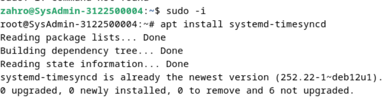
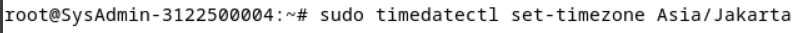
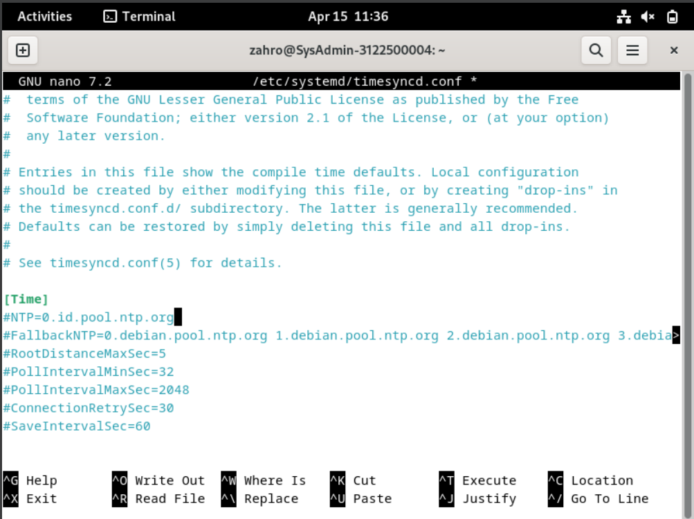
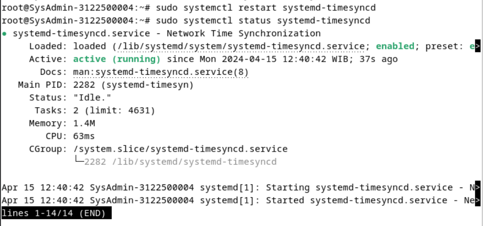
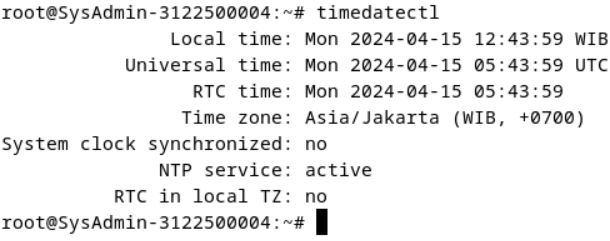

# Konfigurasi NTP Server

## 1. Install NTP (Network Time Protocol)
install NTP dengan perintah
```apt install systemd-timesyncd```


## 2. Konfigurasi NTP ke timezone local (Asia/Jakarta)
```sudo timedatectl set-timezone Asia/Jakarta```


## 3. Konfigurasi RTC (Real Time Clock) ke timezone local (Asia/Jakarta) dan mengaktifkan RTC
- ```sudo timedatectl set-local-rtc false```
- ```bash sudo timedatectl set-ntp true```


## 4. Konfigurasi NTP ke server terdekat
```sudo nano /etc/systemd/timesyncd.conf```
ubah bagian ```NTP=``` menjadi ```NTP=0.id.pool.ntp.org```



## 5. Restart NTP
- ```sudo systemctl restart systemd-timesyncd```
- ```sudo systemctl status systemd-timesyncd```


## 6. Lakukan pengecekan waktu
```timedatectl```


