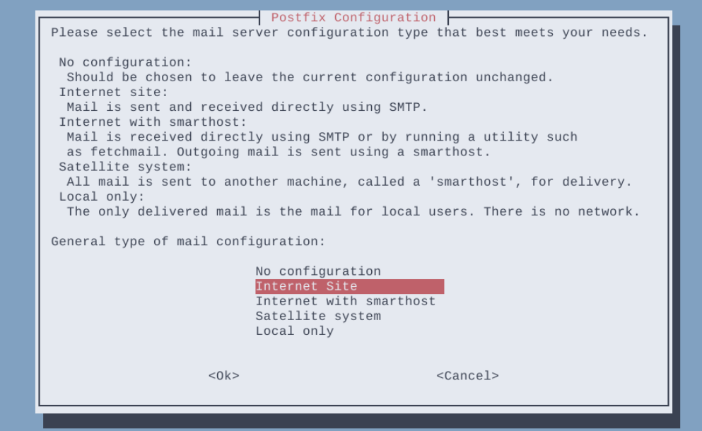
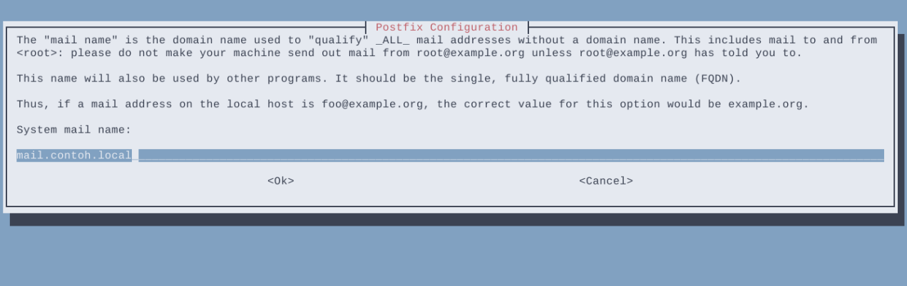
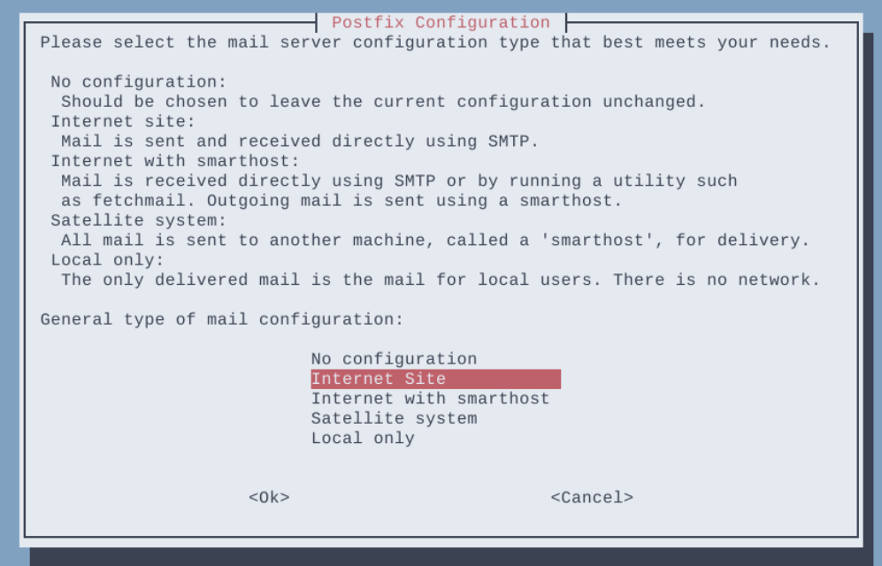
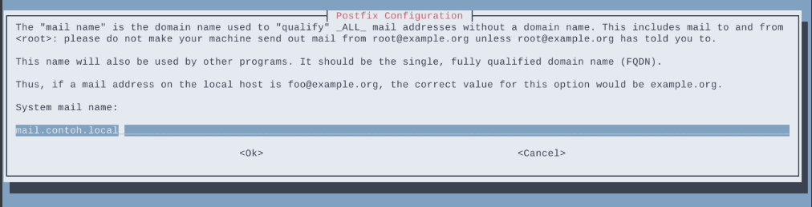
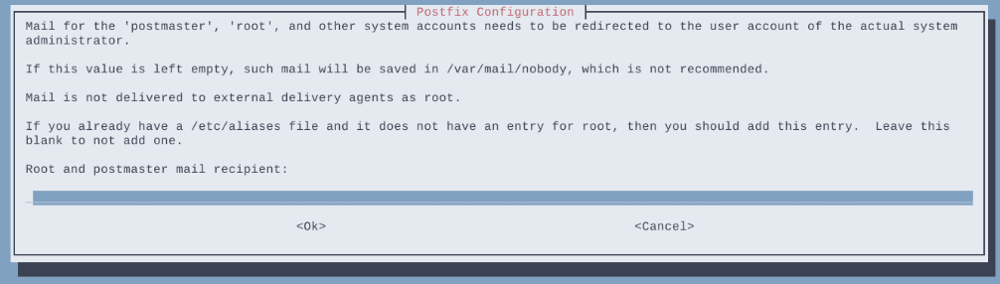
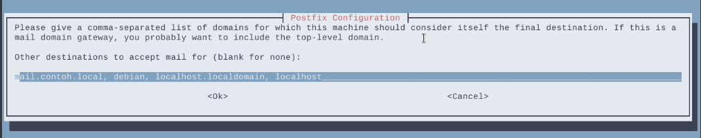
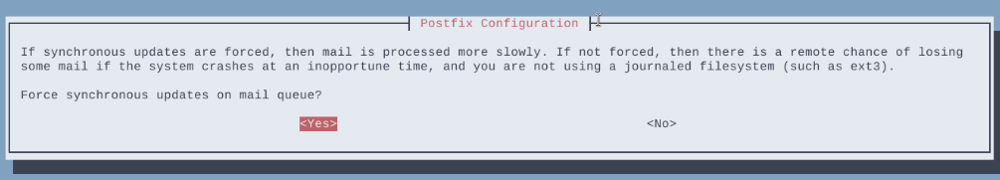
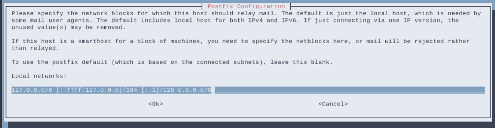
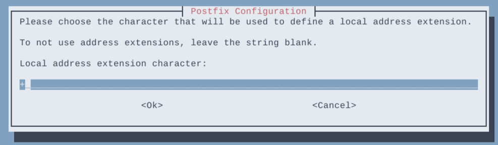
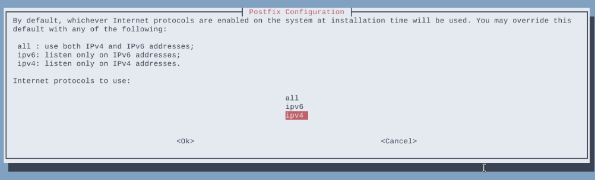

# Konfigurasi Postfix dan Dovecot

## Installasi Postfix dan Dovecot
Update repository dan install package postfix

`apt update`

`apt install postfix dovecot-imapd dovecot-pop3d`

## 1. Konfigurasi Postfix
Setelah installasi selesai akan muncul message box, kemudian pilih internet site agar komunikasi email menggunakan protokol SMTP secara langsung.


Selanjutnya masukkan nama domain yang akan  digunakan


Setelah itu, postfix akan menyelesaikan installasinya. Setelah Installasi selesai, edit file di /etc/postfix/main.cf dan tambahkan home_mailbox = Maildir/ pada baris paling bawah.

`vi /etc/postfix/main.cf`

```
...
inet_interfaces = all
inet_protocols = all
#tambahkan baris berikut pada baris paling bawah
home_mailbox = Maildir/
```

buat mail directory di directory /etc/skel

`maildirmake.dovecot /etc/skel/Maildir`

Setelah itu masukkan perintah berikut

`dpkg-reconfigure postfix`

Pilih beberapa pilihan dan isikan beberapa input yang akan muncul, sesuaikan dengan topology/konfigurasi sistem dan kebutuhan.











Restart postfix service.

`systemctl restart postfix`

## 2. Konfigurasi Dovecot

Edit file konfigurasi /etc/dovecot/dovecot.conf.

`vi /etc/dovecot/dovecot.conf`

Uncomment dan edit baris berikut.

```
...
# If you want to specify non-default ports or anything more complex,
# edit conf.d/master.conf.
listen = *
...
```
Edit file konfigurasi /etc/dovecot/conf.d/10-auth.conf.

`vi /etc/dovecot/conf.d/10-auth.conf`

Uncomment dan ganti dari yes ke no.

```
...
# connection is considered secure and plaintext authentication is allowed.
# See also ssl=required setting.
disable_plaintext_auth = no
...
```
Edit file konfigurasi /etc/dovecot/conf.d/10-mail.conf.

`vi /etc/dovecot/conf.d/10-mail.conf`

Uncomment pada baris berikut.

```
...
mail_location = maildir:~/Maildir
...
```
Beri comment pada baris berikut.

```
...
# mail_location = mbox:~/mail:INBOX=/var/mail/%u
...
```

Restart dovecot service.

`systemctl restart dovecot`

Menambahkan User Email #
Tambahkan beberapa user dan password menggunakan perintah adduser yang akan digunakan untuk user email. Pada percobaan kali ini akan membuat dua user, yaitu satu dan dua.

`adduser satu`
`adduser dua`

Restart postfix dan dovecot service.

`systemctl restart postfix dovecot`

### Testing Postfix dan Dovecot menggunakan Telnet 

Install package telnet.

`apt install telnet`

Test kirim file menggunakan perintah telnet <nama domain> <port> dengan menggunakan port 25 (SMTP). Masukkan nama alamat pengirim menggunakan mail from:. Masukkan nama alamat penerima menggunakan rcpt to:. Ketikkan data lalu enter. Isikan subject dengan megetikkan Subject: <isi subject>. Lalu isikan pesan yang akan dikirim kemudian isikan titik (.) untuk mengakhiri pesan.

`telnet mail.contoh.local 25`

```
Trying 192.168.122.146...
Connected to mail.contoh.local.
Escape character is '^]'.
220 debian ESMTP Postfix (Debian/GNU)
mail from: satu@mail.contoh.local
250 2.1.0 Ok
rcpt to: dua@mail.contoh.local
250 2.1.5 Ok
data
354 End data with <CR><LF>.<CR><LF>
Subject: Testing
Hello World!
.
250 2.0.0 Ok: queued as 7DEAD11DF
quit
221 2.0.0 Bye
Connection closed by foreign host.
```

Melihat pesan menggunakan perintah telnet <nama domain> <port>. Login user menggunakan user <nama user>. Dan masukkan password menggunakan pass <password>. Untuk melihat list pesan yang diterima menggunakan perintah list. Dan untuk membuka pesan yang diterima menggunakan perintah retr <nomer pesan>.<br> Perintah quit untuk keluar dari telnet.

`telnet mail.contoh.local 110`

```
Trying 192.168.122.146...
Connected to mail.contoh.local.
Escape character is '^]'.
+OK Dovecot (Debian) ready.
user dua
+OK
pass 0909
+OK Logged in.
list
+OK 1 messages:
1 436
.
retr 1
+OK 436 octets
Return-Path: <satu@mail.contoh.local>
X-Original-To: dua@mail.contoh.local
Delivered-To: dua@mail.contoh.local
Received: from unknown (unknown [192.168.122.146])
	by debian (Postfix) with SMTP id 7DEAD11DF
	for <dua@mail.contoh.local>; Sun,  5 Feb 2023 00:41:33 +0700 (WIB)
Subject: Testing
Message-Id: <20230204174142.7DEAD11DF@debian>
Date: Sun,  5 Feb 2023 00:41:33 +0700 (WIB)
From: satu@mail.contoh.local

Hello World!
.
quit
+OK Logging out.
Connection closed by foreign host.
```
