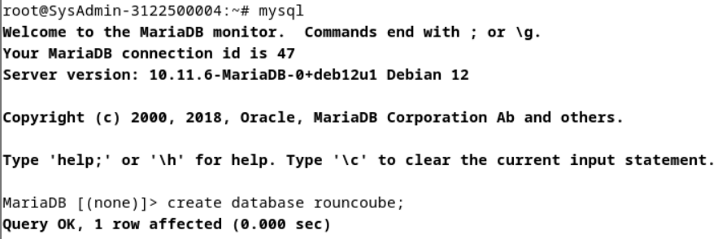
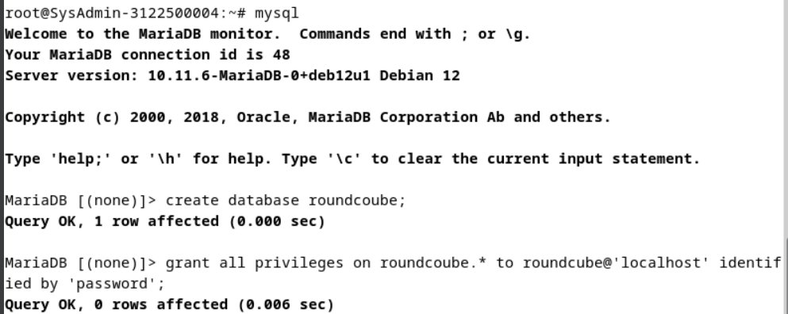
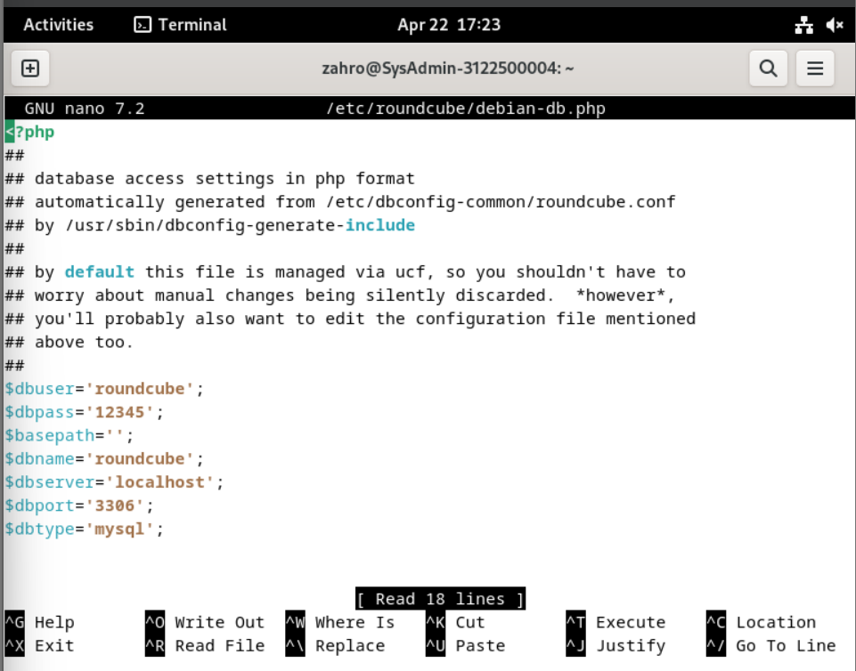
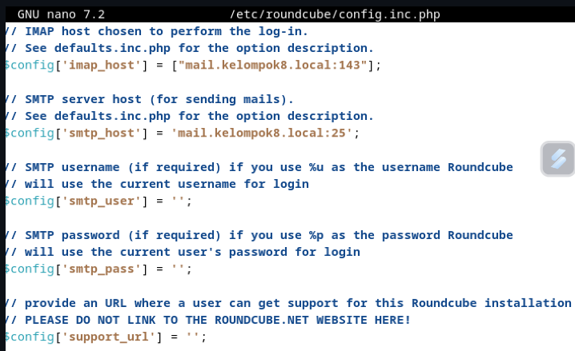
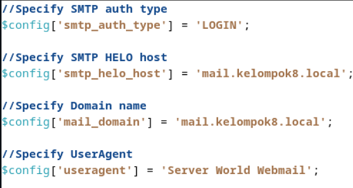
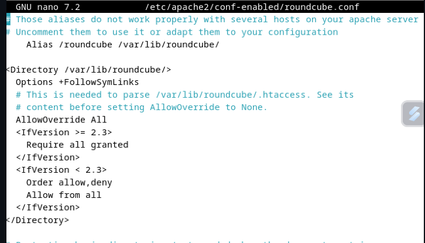
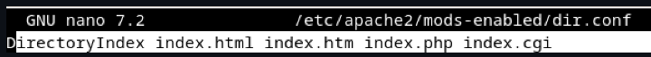
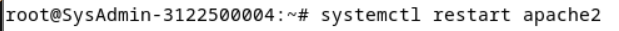

# Konfigurasi Roundcube

1. Create Database
   
2. Configure install and choose no
   
3. Set database info
   
4. File config.inc.php
   

   `add dipaling bawah`
   

5. Uncomment file/etc/apache2/conf-enabled/rouncube.conf
   
6. Ganti config di /etc/apache2/mods-enabled/dir.conf
   
7. Restart apache2
   
8. Hasil
   

  

  
