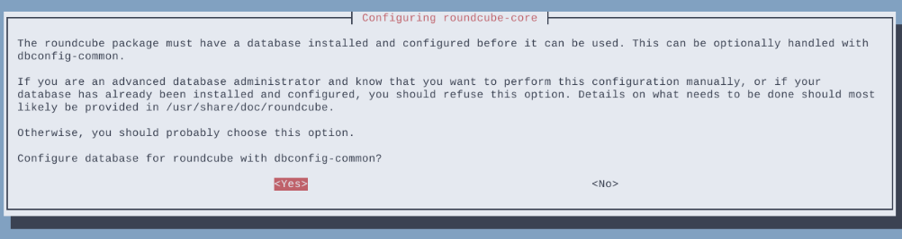
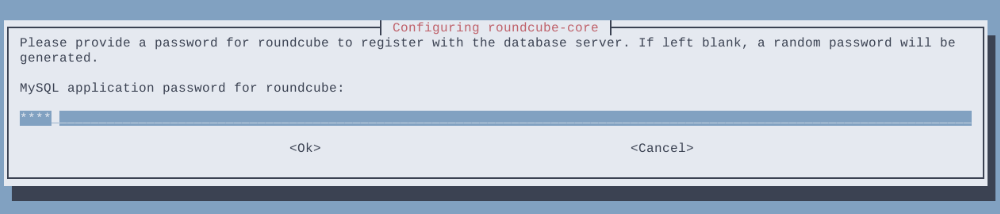
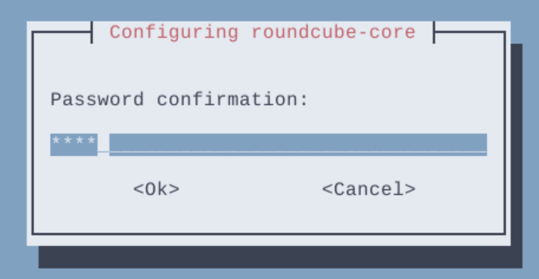
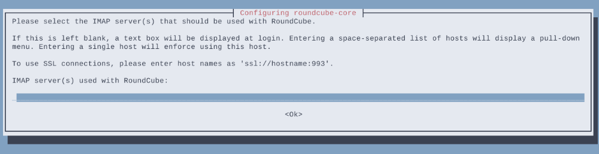
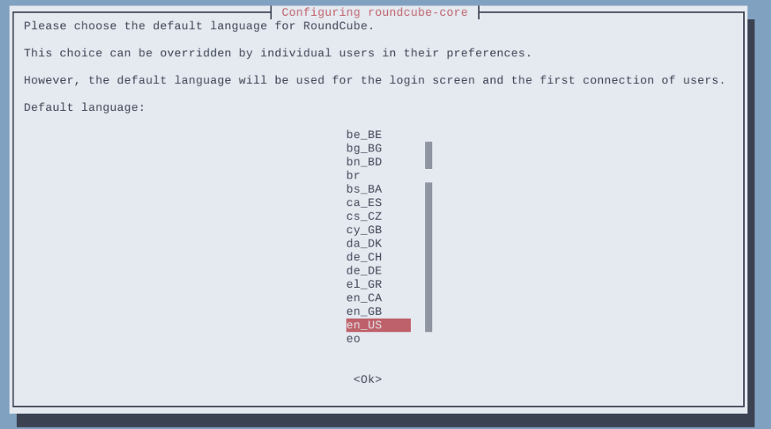
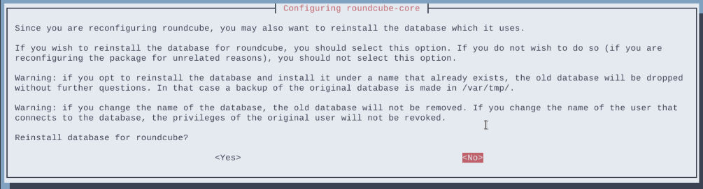
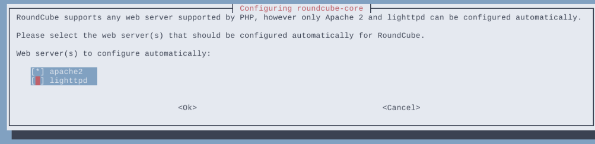
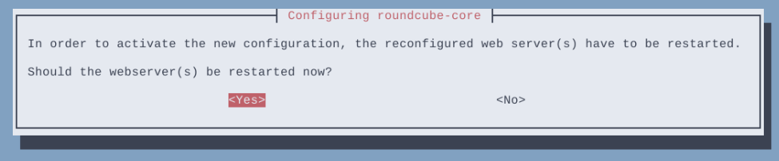
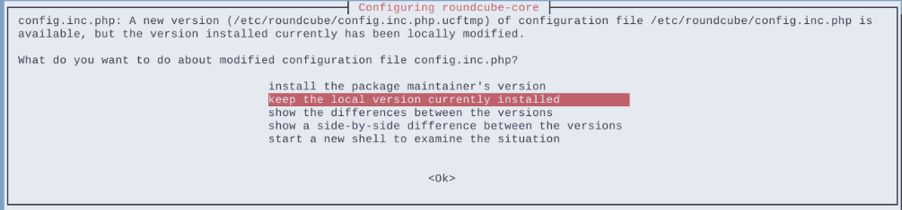
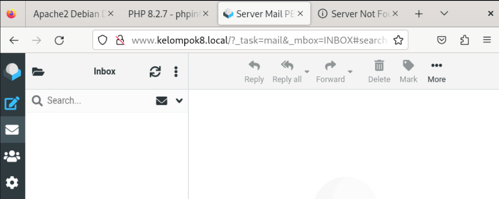

# Konfigurasi Roundcube

### Instalasi Roundcube

`apt install mariadb-server roundcube`

Pilih yes untuk membuat database secara otomatis oleh roundcube.


Masukkan password database roundcube.





Edit file /etc/roundcube/config.inc.php.

`vi /etc/roundcube/config.inc.php`

Isikan default host dengan nama domain mail server.

```
...
// For example %n = mail.domain.tld, %t = domain.tld
$config['default_host'] = 'mail.kelompok8.local';
...
```
Ganti smtp server dengan nama domain mail server.

```
...
// For example %n = mail.domain.tld, %t = domain.tld
$config['smtp_server'] = 'mail.kelompok8.local';
...
```

Ganti smtp port dari 587 ke 25.

```
...
// SMTP port. Use 25 for cleartext, 465 for Implicit TLS, or 587 for STARTTLS (default)
$config['smtp_port'] = 25;
...
```

Kosongkan value dari smtp user.

```
...
// will use the current username for login
$config['smtp_user'] = '';
...
```

Kosongkan value dari smtp password.

```
...
// will use the current user's password for login
$config['smtp_pass'] = '';
...
```
Configure ulang roundcube (langkah ini bisa dilewati).

`dpkg-reconfigure roundcube-core`

Kosongkan karena kita tidak menggunakan tls.


Pilih bahasa untuk roundcube.


Pilih no jika tidak ingin reinstall database yang telah dibuat.



Check pada pilihan apache dan uncheck lighttpd.


Pilih yes untuk merestart web server.


Keep local version jika tidak ingin merubah versi roundcube ke yang lebih terbaru.


Edit apache config untuk memasukkan konfigurasi tambahan dari roundcube ke apache config.

`vi /etc/apache2/apache2.conf
`

Tambahkan pada baris paling bawah.

`Include /etc/roundcube/apache.conf`


Selanjutnya, masuk ke directory website apache dan tambahkan file baru untuk mail server.

```
cd /etc/apache2/sites-available
touch mail.conf
vi mail.conf
```
```
<VirtualHost *:80>
    ServerName mail.kelompok8.local
    DocumentRoot /usr/share/roundcube
</VirtualHost>
```
Disable apache default config dan enable kan mail config.

```
a2dissite 000-default.conf
a2ensite mail.conf
```

Restart apache service.
`systemctl restart apache2
`
### Testing


  

  
