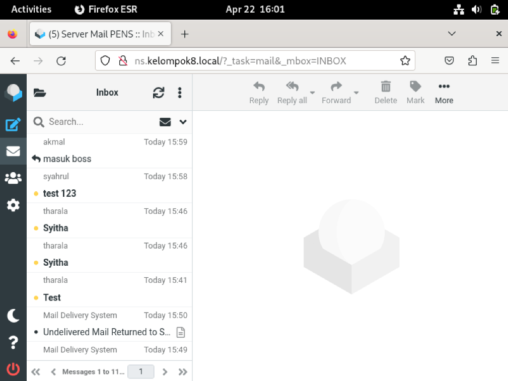

# Konfigurasi Roundcube

1. Create Database
   
2. Configure install and choose no
   
3. Set database info
   
   
4. File config.inc.php
   
   

   ```add dipaling bawah```
   
   

5. Uncomment file/etc/apache2/conf-enabled/rouncube.conf
   
   
6. Ganti config di /etc/apache2/mods-enabled/dir.conf
    
   
   
7. Restart apache2
    
   
   
8. Hasil
   


# Setting Mailserver untuk jaringan di Lab C307

1. Ubah pada setting network pada virtual machine ke Bridged Adapter dan ganti adapter sesuai dengan hasil command ipconfig/all yaitu Realtek USB FE Family Controller 2
  

2. Rubah juga konfigurasi di sudo nano /etc/resolv.conf tambahkan nameserver 192.168.8.10 seperti dibawah berikut:
   
3. Setelah itu coba tes ping IP kelompok lain yaitu kelompok 1 dengan command ping ns.kelompok1.local jika konfigurasi network benar maka maka hasilnya akan seperti berikut:
   
4. Coba juga tes nslookup ke kelompok lain dengan command nslookup kelompok1.local jika konfigurasi network benar maka akan seperti dibawah ini:
   
5. Buka browser dan coba test apakah bisa mengakses webmail (roundcube) kelompok lain disini saya mencoba mengakses ke webmail kelompok 2 dengan alamat mail.kelompok2.local Jika berhasil maka akan tampil seperti berikut:
   
6. Buka browser dan coba test apakah bisa mengakses webmail (roundcube) dengan alamat mail.kelompok8.local/roundcube Jika berhasil maka akan tampil seperti berikut:
   
7.  Jika network static tidak bekerja dan tidak bisa tampil seperti diatas maka coba buka sudo nano /etc/network/interfaces buat auto network dengan mengcomment konfigurasi static pada seperti dibawah ini:
   
8. Lalu setup manual IPv4 dengan IP addres 192.168.8.10 netmask 255.255.255.0 gateway 192.168.4.1 dan DNS 10.10.10.1

9. Hasil Akhir
   Login ke rouncube dengan user dan password yang sudah disetup. pada kasus ini saya bisa mengirim dan menerima pesan dari user lain seperti pada gambar dibawah ini:
   
   
