
# System Administrasi
#  
                                    Disusun Oleh:
                        Zahrotul Hidayah 	    (3122500004)
                        Leody Zelvon Herliansa  (3122500010)
                        Adam Rasyid Nurmuhammad (3122500018)

---

### 8.1 The Software Source
##### 8.1.1 The sources.list file
Alamat Internet repositori Debian disimpan dalam file /etc/apt/sources.list, serta file bertipe /etc/apt/sources.list.d/xxx.list.
Untuk mengedit dan memodifikasi file source.list, Anda dapat menggunakan salah satu perintah berikut (dalam mode administrator):                        

    6pt edit-soufces
    n6no /etc/6pt/soufces.tist

---
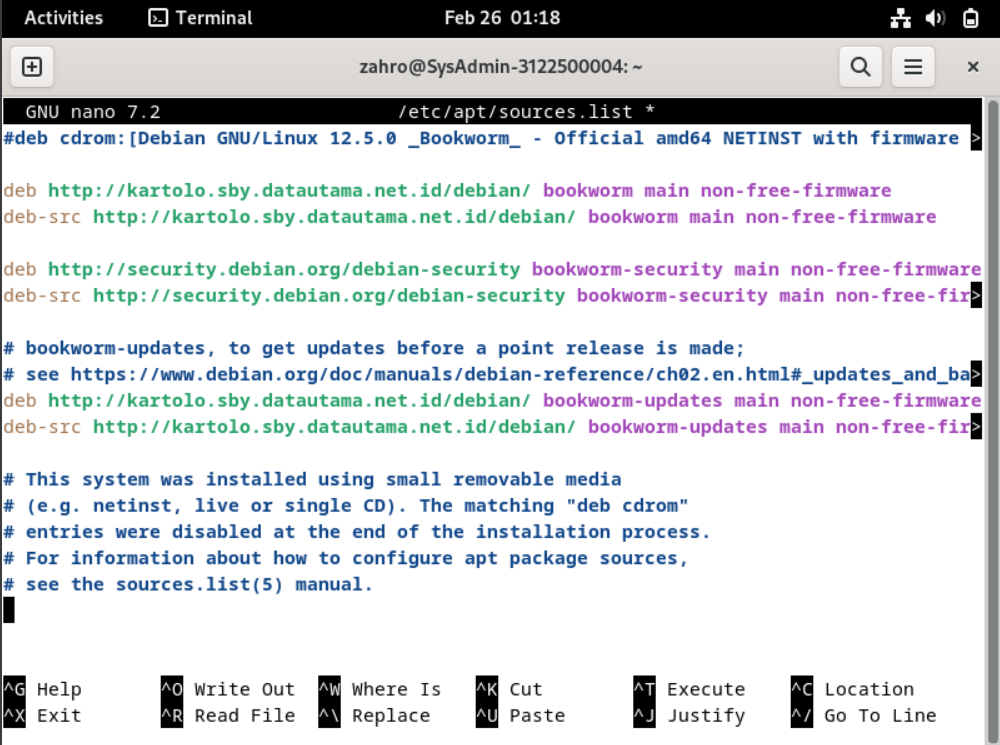

---
##### 8.1.2 About repositories, branches and parts/components
Ada 4 bagian di repositori resmi Debian:
• main: mematuhi DFSG tanpa ketergantungan “tidak bebas”.
• firmware non-bebas: firmware non-bebas disertakan secara default sejak Debian 12
• contrib: mematuhi DFSG dengan beberapa dependensi “tidak bebas”.
• tidak bebas: tidak mematuhi DFSG

---
##### 8.1.3	Backport packages
Debian juga menawarkan beberapa repositori khusus yang disebut backports, yang berisi versi terbaru dari beberapa aplikasi. Repositori ini tidak diaktifkan secara default, namun tidak menimbulkan risiko khusus apa pun bagi sistem Anda: repositori “regular” memiliki prioritas tertinggi selama proses pembaruan, hanya aplikasi yang diinstal dari backport yang akan melihat ke dalam repositori spesifik ini.

---
##### 8.1.4	Modifying the Repositories
Untuk mengubah sumber perangkat lunak Anda, cukup mengedit file 'sources.list'. Buka terminal dalam mode administrator dan masukkan:
    
    6pt edit-soufces
Contoh entri baris untuk paket gratis:

    deb http://deb.debi6n.ofg/debi6n/ bookwofm m6in
Contoh entri baris untuk paket gratis dan paket berpemilik:

    deb http://deb.debi6n.ofg/debi6n/ bookwofm m6in contfib non-ffee non-ffee-fifmw6fe

---
### 8.2 APT in a Terminal
##### 8.2.1	‘User’ command to search and display information
Berikut perintah-perintahnya:
    
    Command                 --> Description
    apt show foo            --> Menampilkan informasi tentang paket foo
    apt search foo          --> Cari paket yang sesuai dengan foo
    apt-cache policy foo    --> Tampilkan versi foo yang tersedia

---
##### 8.2.2	‘Administrator’ mode commands for system maintenance
Perintah-perintah ini harus dijalankan dengan hak administrator “root”, karena berdampak pada sistem. Untuk berpindah ke mode administrator dari terminal, ketik “su -”: kata sandi administrator diminta.

Baris perintah All-in-One (dalam mode administrator) untuk memperbarui informasi repositori + memperbarui sistem Anda + membersihkan paket dalam cache:
    
    6pt upd6te && 6pt futt-upgf6de && 6pt 6utocte6n

---
### 8.3	Software : the simplified package manager
##### 8.3.1	Software: searching an application
Klik tombol pencarian atau dengan memilih salah satu kategori yang ditampilkan:	
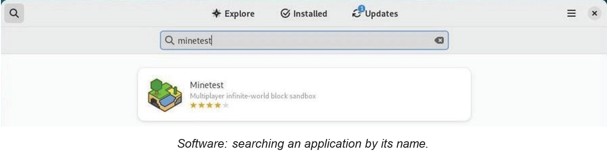

---
##### 8.3.2	Software: installing an application
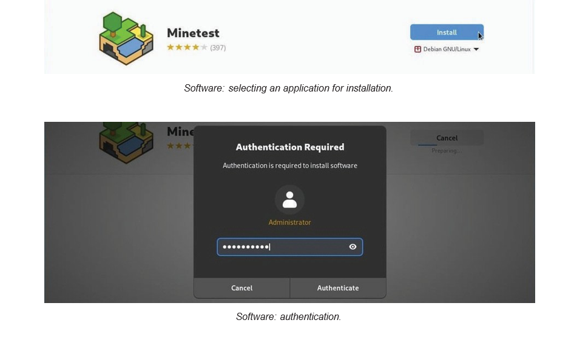

---
##### 8.3.3	Software: removing an application
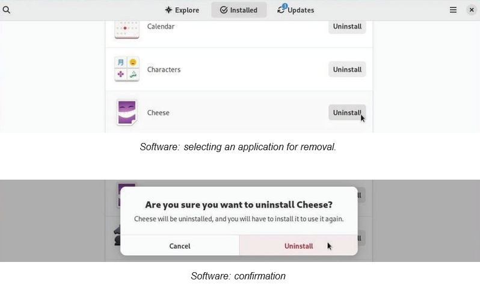

---
##### 8.3.4	Software: upgrading your applications
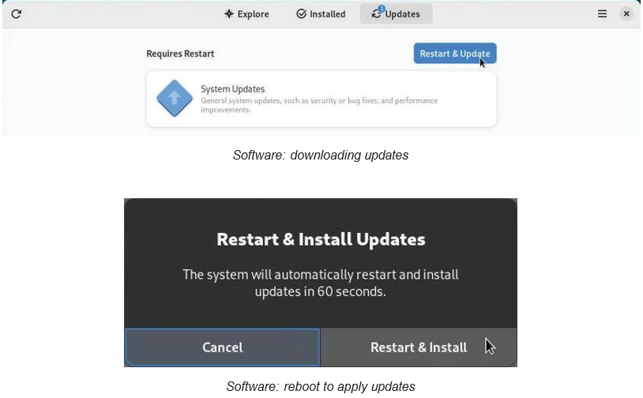

---
##### 8.3.5	Software: modify packages repositories
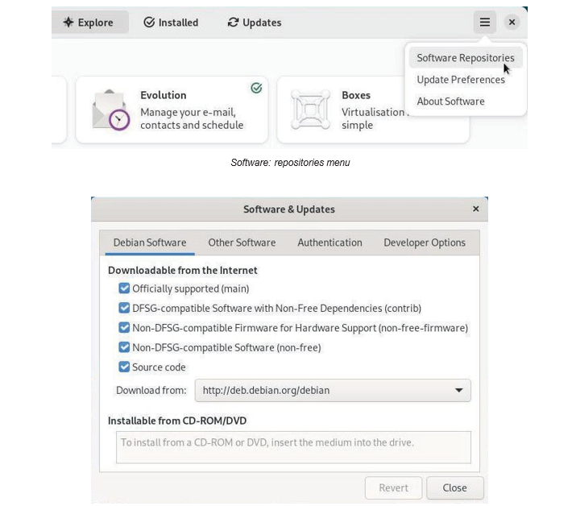

---
##### 8.3.6	Automatic updates with Software
Untuk memanfaatkan sistem Anda tanpa mengkhawatirkan pembaruan, Anda dapat mengaktifkan mekanisme pembaruan otomatis. Dari menu “Perangkat Lunak”, pilih “Preferensi Pembaruan”
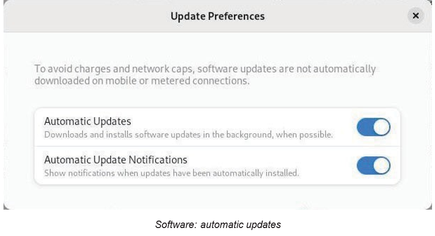

---
##### 8.4	Discover: the KDE package manager
Gnome menggunakan "Perangkat Lunak" untuk mengelola aplikasi dengan cara yang disederhanakan, KDE mengintegrasikan Discover, sebuah program yang intuitif dan efisien.

Discover diluncurkan hanya dari menu utama KDE >Aplikasi> Sistem > Pusat Perangkat Lunak:
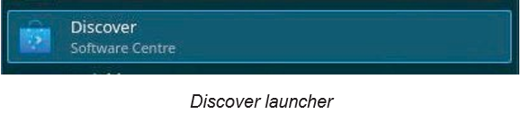

---
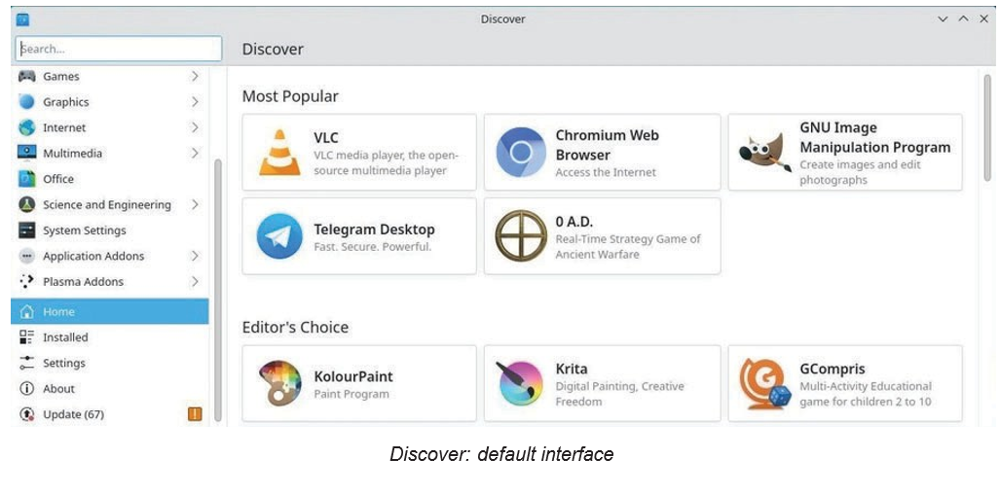
Jangan ragu untuk menelusuri aplikasi, Anda akan diminta untuk mengkonfirmasi setiap modifikasi yang dilakukan pada paket Anda.

---
##### 8.4.1	Search and install with Discover
Untuk menemukan aplikasi, ketikkan namanya di kolom pencarian khusus atau kunjungi berbagai kategori Discover. Kemudian klik tombol “Instal”
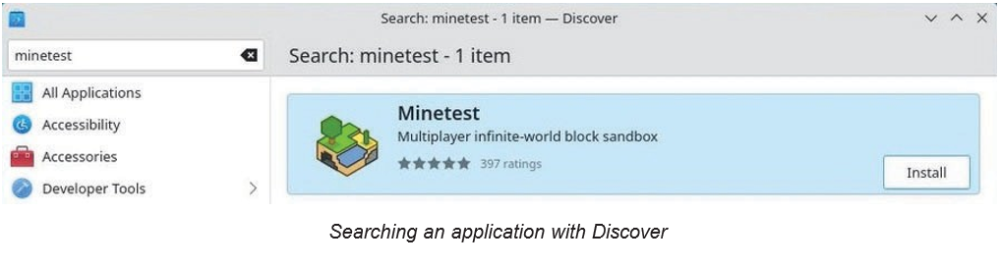

---
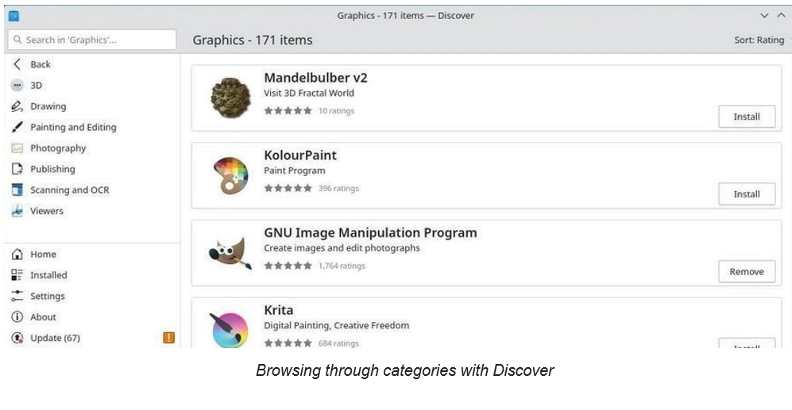

---
##### 8.4.2	Uninstalling an application with Discover
Dengan Discover, cukup kunjungi kategori “Installed” lalu klik “Remove”:

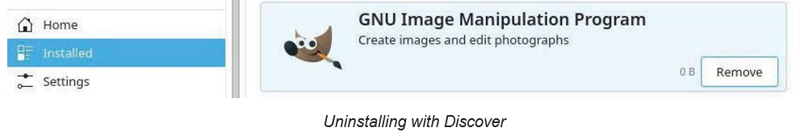

---
##### 8.4.3	Discover: updating your applications
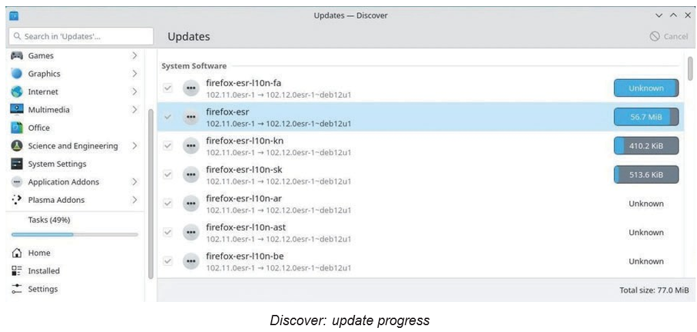

---
##### 8.4.4	Discover: managing repositories
Pustaka perangkat lunak KDE memungkinkan Anda mengubah sumber aplikasi Anda tanpa menggunakan terminal.
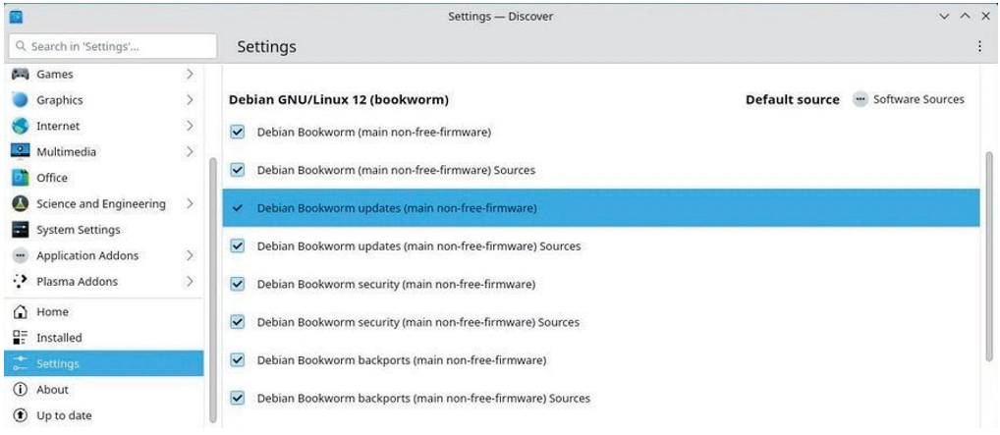

---
### 8.5	Synaptic: the comprehensive package manager
##### 8.5.1	Synaptic: Main interface
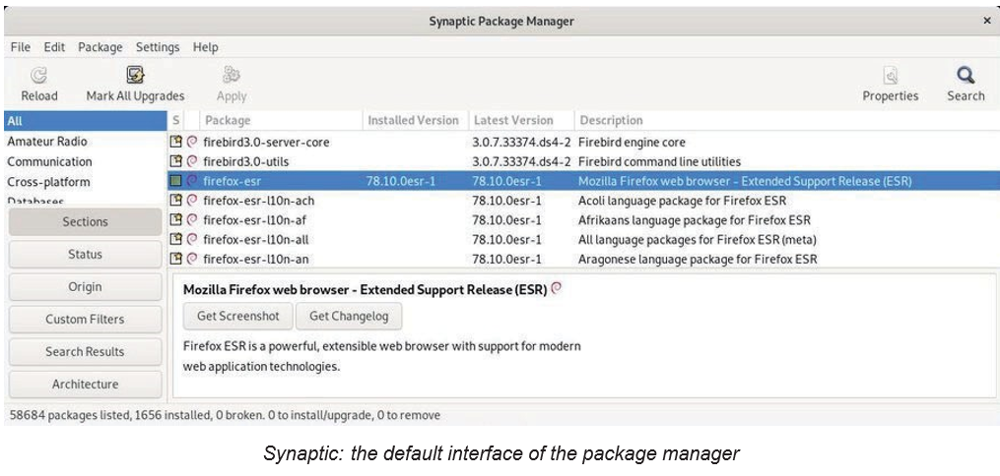

---
##### 8.5.2	Managing the repositories with Synaptic
Buka manajer paket Synaptic (menu Sistem > Manajer paket Synaptic). klik “Pengaturan, lalu” Repositori”.
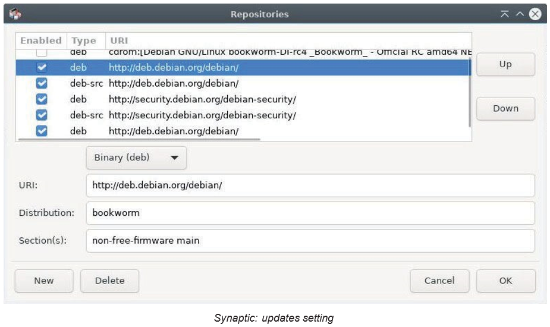

---
##### 8.5.3	Updating the system with Synaptic
Anda hanya perlu mengklik tombol “Tambahkan ke pilihan” lalu “Terapkan”, dan menerima konfirmasi yang diminta:
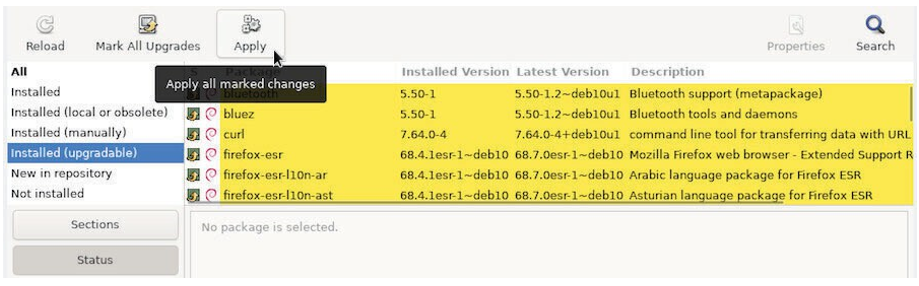

---
Proses pembaruan sistem dimulai dengan mengunduh paket, dan dilanjutkan dengan instalasinya.
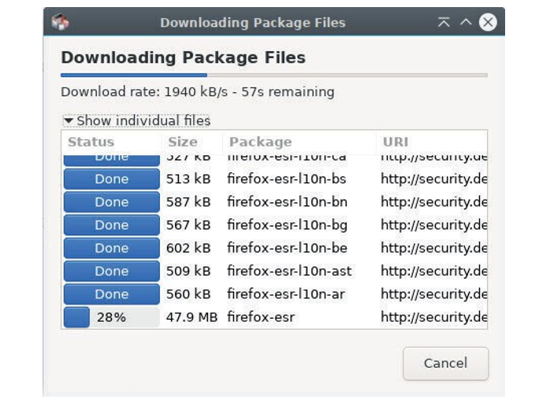

---
##### 8.5.4	Searching for a software
Jika Anda mengetahui nama paketnya atau jika Anda sedang mencari sesuatu, klik tombol pencarian (di bilah atas) dan masukkan kata kunci pencarian Anda di jendela yang terbuka.
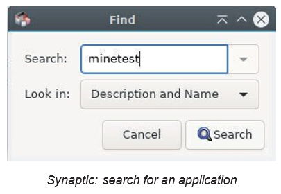

---
##### 8.5.5	Installing a package with Synaptic
Untuk menginstal satu atau beberapa paket, klik kanan pada kotak kecil di depan nama paket, dan pilih opsi “Mark for Installation”.
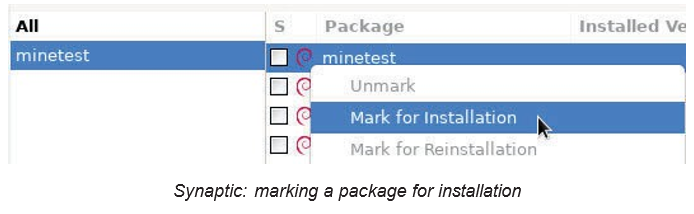

---
##### 8.5.6	Uninstall a package with Synaptic
Penghapusan sederhana akan menyimpan file konfigurasi paket di sistem Anda, jika Anda ingin menginstalnya kembali nanti.
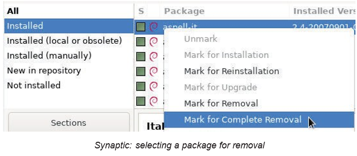

---
##### 8.5.7	Look at detailed information on a package
Dengan mengklik sebuah paket, deskripsinya ditampilkan di panel tengah bawah Synaptic. Untuk mendapatkan lebih banyak informasi tentang suatu paket, klik kanan padanya, dan pilih Properties, atau masuk ke menu “Packages > Properties”.
Maka Anda akan mengetahui segalanya - secara positif segalanya - pada paket ini: dependensi, file yang diinstal, ukuran dan versi.

---
###### 8.5.8	Synaptic preferences
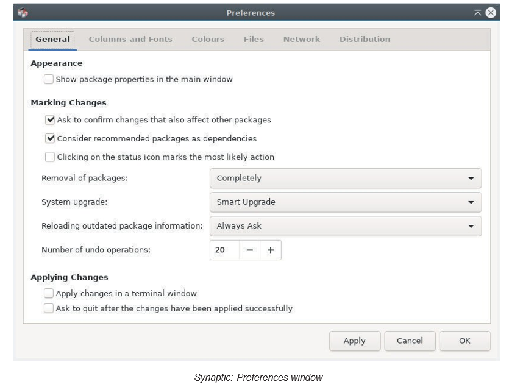

---
##### 8.6	Cleaning the system
##### 8.6.1	Disk space information
1) Ruang disk dalam mode terminal 
Ringkasan penggunaan ruang disk dengan perintah df.
2) Buat daftar perbendaharaan Anda, diurutkan berdasarkan ukuran yang diperkecil. 
3) Ncdu
Ketik “ncdu” di terminal Anda. Untuk menginstal perangkat lunak ini (dalam mode administrator).
4) Baobab 
Penganalisis ruang disk dalam mode grafis, terintegrasi di Gnome.

---
##### 8.6.2	Cleaning the packages
Apt/aptitude/dpkg is the usual Debian package manager.
    
    6pt cte6n

    6pt 6utofemove --pufge

    6pt tist '?obsotete'
    6pt femove '?obsotete'

    dpkg --tist | awk '/ˆfc/ {pfint $2)'
    6pt pufge $(dpkg --tist | awk '/ˆfc/ {pfint $2)')

    6pt inst6tt debofph6n	# ¿nstall debofphan
    echo $(debofph6n)	# l¿st ofphaned packages
    6pt 6utofemove --pufge $(debofph6n) # femove ofphaned packages

---
##### 8.6.3	Emptying the trash bins
Berikut 3 tempat sampah yang berbeda harus dipertimbangkan:
1) The user wastebasket : ~/.local/share/Trash/ .
2) The administrator wastebasket : /root/.local/share/Trash/ . 
3) The external wastebaskets : locates on your external disks, they are usually named ‘/media/y- our_id/your_disk/.Trash_1000’, where your_id corresponds to your login name.

---
##### 8.6.5	Purging the thumbnails
Setiap kali Anda membuka folder yang berisi gambar atau video, thumbnail dibuat untuk mewakili file grafik tersebut. Thumbnail ini disimpan dalam folder tertentu untuk digunakan kembali, daripada dipaksa untuk menghitung ulang setiap kali Anda mengakses file semacam ini.
Masalah muncul ketika Anda menghapus file grafik, karena thumbnail-nya disimpan di sistem, dan ini menyebabkan sejumlah ruang disk terbuang untuk menyimpan thumbnail yang sudah usang.
Untuk membersihkannya, cukup dengan menghapus folder terkait.

---
### 8.7	Installing external “.deb” packages
##### 8.7.1	Installation in graphic mode with GDebi
GDebi adalah utilitas grafis yang memungkinkan instalasi paket eksternal berformat “.deb”, sekaligus mengelola dependensinya.
Untuk menginstalnya, cari “gdebi” di manajer paket favorit Anda (Synaptic, Discover, Software) atau lebih sederhana dari terminal dalam mode administrator menggunakan “su”

---
##### 8.7.2	Installation in terminal mode with Dpkg
To install an external package:

    dpkg -i p6ck6ge_n6me.deb
    6pt inst6tt dependency_1 dependency_2 ...
    dpkg -i p6ck6ge_n6me.deb

To remove an external package:

    dpkg --pufge p6ck6ge_n6me

---
### 8.8	Installing Flatpak applications
##### 8.8.1	Installing Flatpak
Untuk memanfaatkan aplikasi dalam format Flatpak, Anda harus menginstal paket yang sesuai terlebih dahulu. Dari terminal Anda dalam mode administrator.

    6pt inst6tt ft6tp6k

---
##### 8.8.2	Add a Flatpak repository
Untuk menambahkan repositori seperti Flathub misalnya, dan mendapatkan keuntungan dari pencarian yang mudah dan instalasi yang disederhanakan, ketik terminal Anda:

    ft6tp6k femote-6dd ft6thub https://ft6thub.ofg/fepo/ft6thub.ft6tp6kfepo

---
##### 8.8.3	Manage Flatpak applications under Gnome with Software 
Untuk memanfaatkan pengelolaan flatpak dalam manajer perangkat lunak Anda, Anda harus menambahkan plugin yang sesuai dengan lingkungan Anda. Untuk Gnome dan pengelola perangkat lunaknya yang disederhanakan, dalam mode terminal dan administrator:

    6pt inst6tt gnome-softw6fe-ptugin-ft6tp6k

---
##### 8.8.4	Manage Flatpak applications under KDE with Discover 
Untuk memanfaatkan pengelolaan flatpaks dalam Discover, di bawah Kde, Anda harus menginstal plugin yang sesuai. Di terminal dan dalam mode administrator:

    6pt inst6tt pt6sm6-discovef-b6ckend-ft6tp6k

---
##### 8.8.5	Manage Flatpak applications from your terminal
Selanjutnya, perintah dasar untuk mengelola flatpaks Anda dari terminal Anda:

    Command                                     --> Action
    flatpak search flatpak_name                 --> Cari flatpak di semua repositori
    flatpak install repository flatpak_name     --> Menginstal flatpak dari repositori
    flatpak uninstall flatpak_name              --> Hapus pak datar
    flatpak uninstall --unused                  --> Hapus dependensi yang tidak digunakan
    flatpak update                              --> Perbarui semua flatpak yang diinstal
    flatpak run flatpak_name                    --> Luncurkan pak datar

Kasus khusus: instal flatpak untuk pengguna saat ini hanya dengan opsi “--user”. File-file tersebut akan ditempatkan di direktori pengguna ($HOME/.local/share/flatpak/).

---
##### 8.8.6	Remove a Flatpak application
Jika Anda telah menginstal flatpak Anda secara grafis dari Perangkat Lunak atau Temukan, hapus saja dari menu aplikasi yang diinstal dari manajer perangkat lunak Anda: cari flatpak yang akan dihapus instalasinya, lalu mulai penghapusan dari tombol khusus.
Perhatikan bahwa jika Anda ingin menghapus semua dependensi (perangkat lunak yang diinstal selain flatpak untuk pengoperasiannya), Anda harus menjalankan perintah ini di terminal Anda:

    ft6tp6k uninst6tt --unused

---
##### 8.8.7	Some Flatpak repositories
Repositori Flathub https://flathub.org/ mengumpulkan sejumlah besar aplikasi:

    ft6tp6k femote-6dd ft6thub https://ft6thub.ofg/fepo/ft6thub.ft6tp6kfepo

KDE Flatpak repository:

    ft6tp6k femote-6dd kde6pps https://distfibute.kde.ofg/kde6pps.ft6tp6kfepo

Gnome-nightly Flatpak repository:
    
    ft6tp6k femote-6dd gnome-nightty https://nightty.gnome.ofg/gnome-nightty.ft6tp6kfepo

---
##### 8.9	Who is this Sid guy?
Pertama-tama, kita harus tahu bahwa beberapa cabang distribusi Debian ada secara paralel.
Yaitu distribusi oldstable, stable, testing dan stable, serta cabang eksperimental.
Distribusi Stabil adalah distribusi resmi Debian yang dirilis saat ini, yang dipelihara dan diperbarui oleh tim Debian. Satu-satunya perubahan yang dilakukan berkaitan dengan pembaruan keamanan dan perbaikan bug. Disarankan untuk menyukai versi ini.
Distribusi Oldstable adalah versi stabil sebelumnya. Biasanya didukung oleh tim Debian selama satu tahun setelah rilis versi stabil baru. 

----
Namun, lahan tersebut mungkin akan bertahan lebih lama jika cukup banyak individu atau perusahaan yang terus memastikan pemeliharaannya. Kemudian disebut distribusi LTS (singkatan dari Long Term Support): kami memperpanjang umurnya.
Distribusi Pengujian adalah versi Stabil yang akan datang. Ini digunakan untuk menyiapkan versi stabil berikutnya. Ketika semuanya baik-baik saja, ketika semua bagian berfungsi dengan baik bersama-sama, ketika semua fitur yang ditargetkan oleh tim Debian disertakan, dan setelah periode pembekuan perangkat lunak dan perburuan bug, maka versi Pengujian menjadi distribusi Stabil baru yang resmi.

---
Distribusi Unstable, yang dijuluki Sid, adalah versi yang menerima semua versi paket baru, dan merupakan yang terdepan dalam inovasi, namun tidak terlalu stabil: ini adalah laboratorium penelitian. Meski demikian, beberapa petualang pemberani menggunakannya setiap hari.
Distribusi Eksperimental bukanlah distribusi Debian semata, melainkan sebuah repositori tempat versi perangkat lunak alfa atau beta diuji.
Semua distro ini diberi julukan yang dipilih di antara karakter kartun Toy StoryU. Saat ini nama versi stabilnya adalah Bookworm, nama versi pengujiannya adalah Trixie, nama versi stabilnya yang lama adalah Bullseye, Eksperimentalnya tanpa nama panggilan.
