# Konfigurasi Database Server (MariaDB)

## 1. Install MariaDB
```sudo apt -y install mariadb-server```
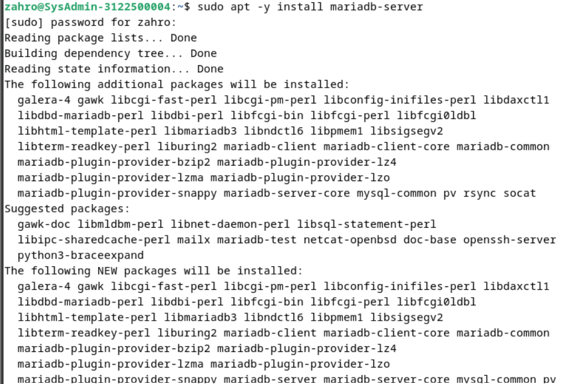

## 2. Konfigurasi MariaDB
```sudo /etc/mysql/mariadb.conf.d/50-server.cnf```
ubah line 95 menjadi
```
character-set-server = utf8mb4
collation-server = utf8mb4_general_ci
```

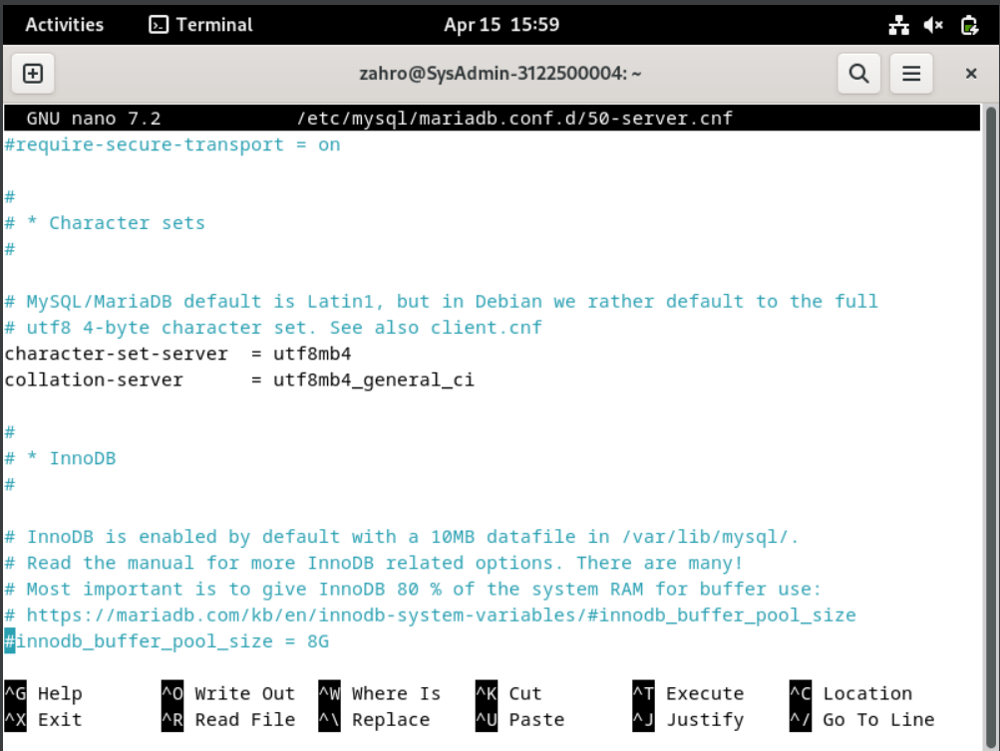

```sudo systemctl restart mariadb```


## 3. Inisial Konfigurasi dan testing database MariaDB Server
```sudo mysql_secure_installation```

Isikan konfigurasi inisial seperti berikut:

- Enter current password for root (enter for none): Just press the Enter : (isi password root)
- Switch to unix_socket authentication [Y/n] : n
- Remove anonymous users? [Y/n] : Y
- Disallow root login remotely? [Y/n] : Y
- Remove test database and access to it? [Y/n] : Y
- Reload privilege tables now? [Y/n] : Y

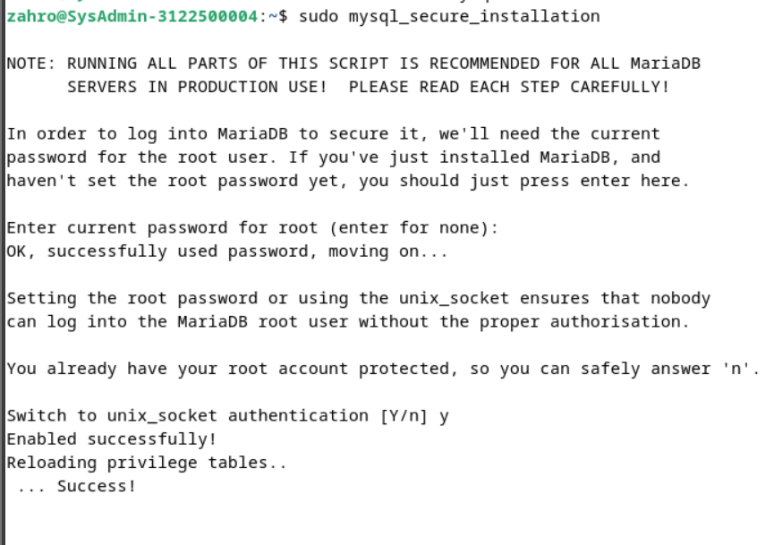
  
## 4. Login ke MariaDB
```sudo mysql -u root -p```

masukkan password yang sudah di set pada saat konfigurasi inisialisasi
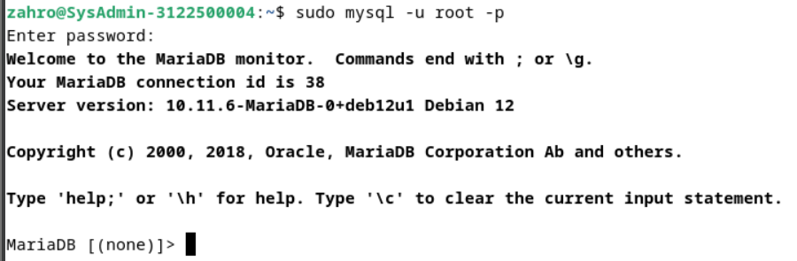

## 5. Uji Coba Database
- tampilkan hak akses user root

    ```show grants for 'root'@'localhost';```

    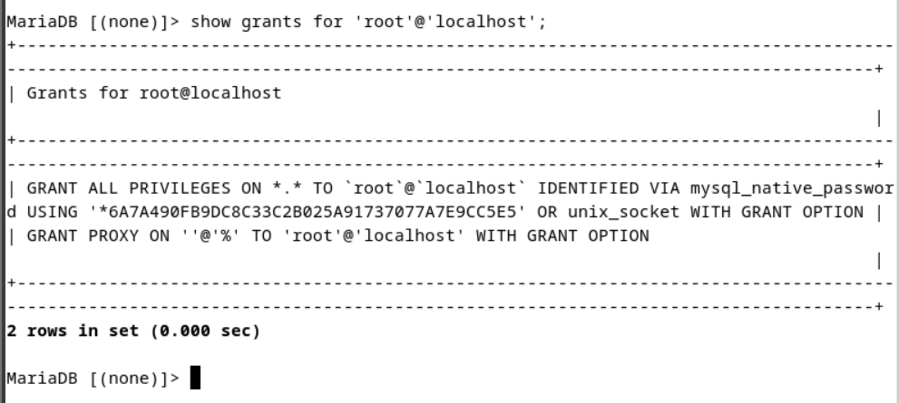

- tampilkan user,host dan password dari db mysql dan tabel user

    ```select user,host,password from mysql.user;```

    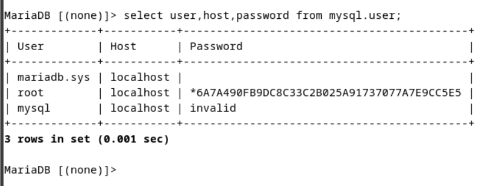

- tampilkan database yang ada

    ```show databases;```

    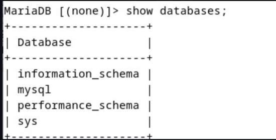

- buat database baru

    ```create database test;```

    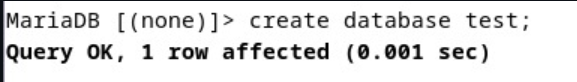

- buat tabel baru

    - ```use test;```

    - ```create table test.test_table (id int, name varchar(50), address varchar(50), primary key (id));```

      

- tambahkan data ke tabel

    ```insert into test_table values (1, 'test', 'test address');```

    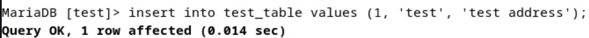

- tampilkan data dari tabel

    ```select * from test_table;```

    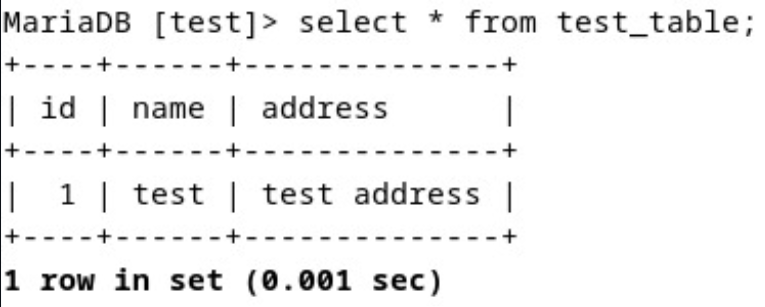

- keluar dari database

    ```exit```

    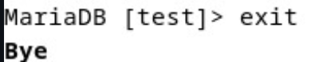

    