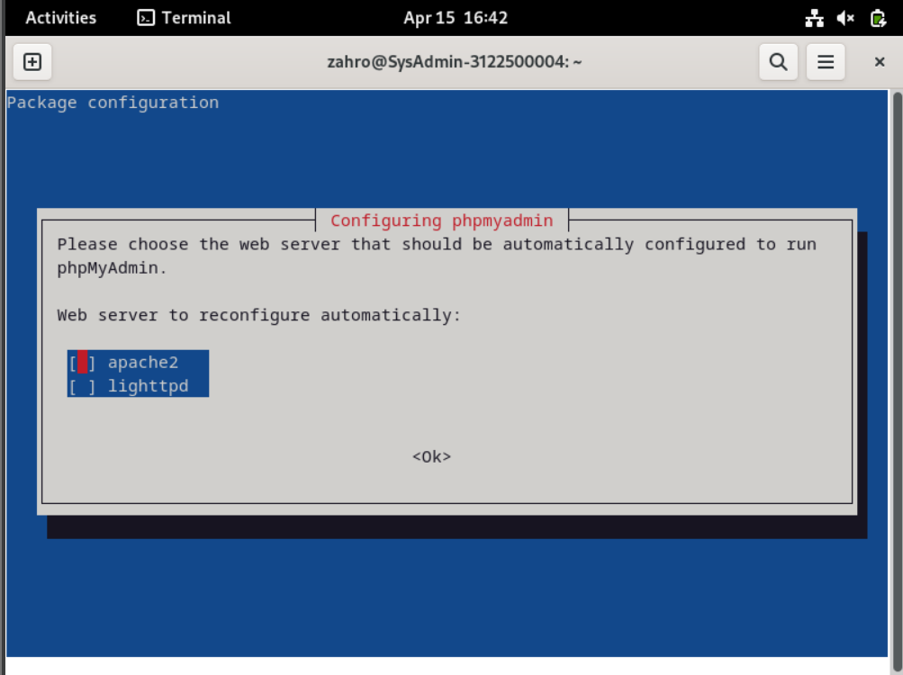
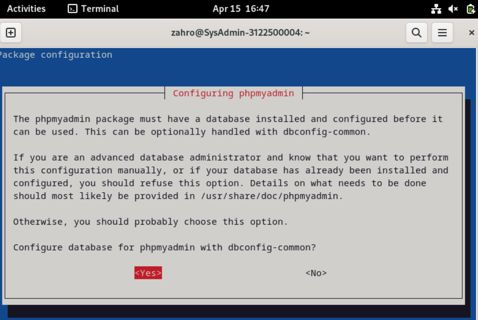
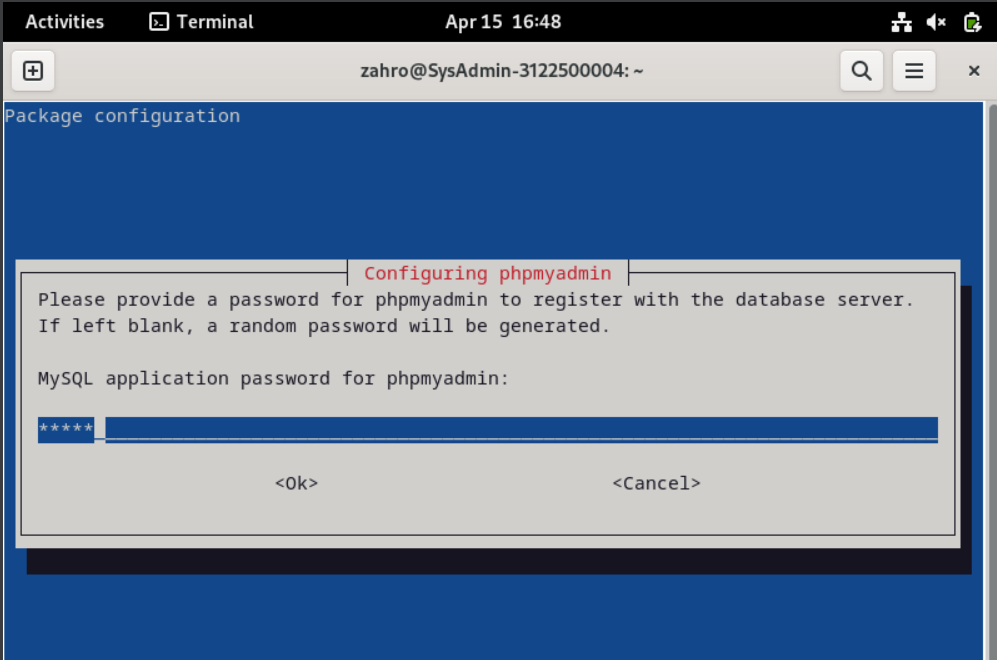
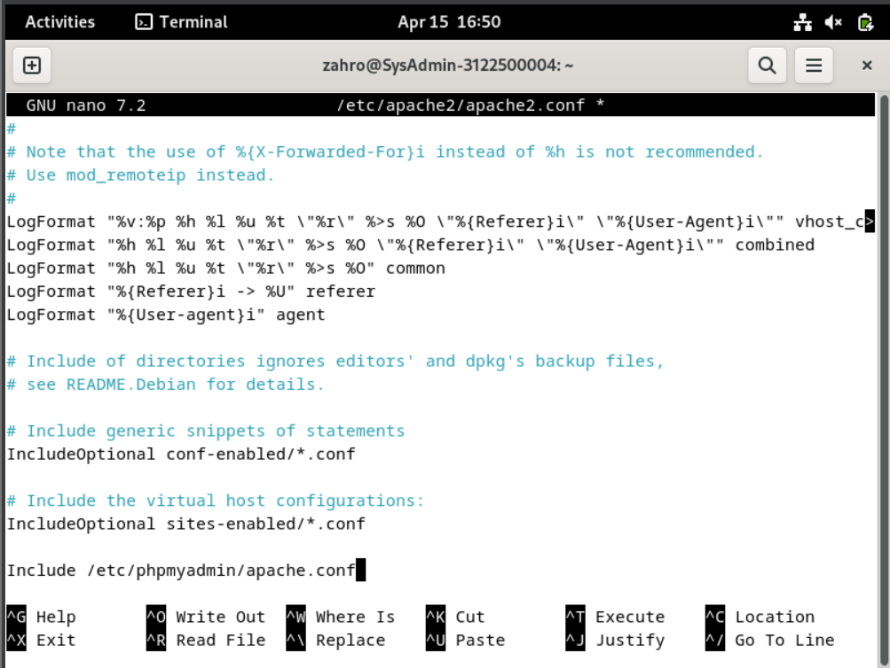

# Install phpmyadmin

## 1. Install phpmyadmin
```sudo apt -y install phpmyadmin```
Konfigurasi installasi
- Pilih web server yang digunakan, pada contoh ini menggunakan apache2
  
  

- Pilih configure database for phpmyadmin dengan dbconfig-common
  
  

- Masukkan password root phpmyadmin dan konfirmasi password root phpmyadmin
  
 

## 2. Konfigurasi phpmyadmin pada apache2
```sudo nano /etc/apache2/apache2.conf```


Tambahkan baris berikut pada file konfigurasi apache2 di bagian paling bawah
```
Include /etc/phpmyadmin/apache.conf
```


## 3. Restart apache2
```sudo systemctl restart apache2```


